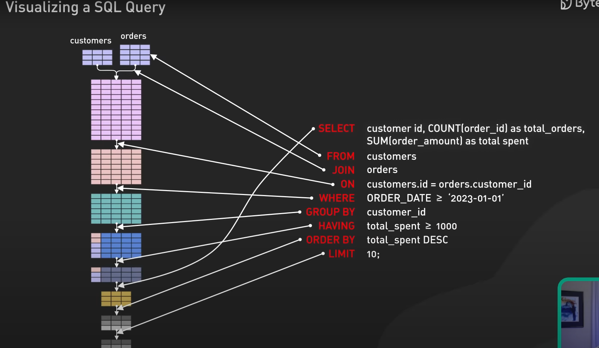

<< [README](README.md)

# SQL Functions

## Contents
- [Basic Functions](#basic-functions)
- [Resources](#resources)

## Basic Functions
- SELECT - Specifies a column to retrieve data from in a database
- FROM - Specifies the table to retrieve data from in a database
- ORDER BY - Sorts the result based on a column
- WHERE - Used to filter records based on a condition, e.g. WHERE condition
- AND - Used in conjunction with WHERE to have multiple filters
- AS - Gives a column or table a temporary alias

# Resources

- [Secret to Optimizing SQL Queries - Understand The SQL Execution Order](https://www.youtube.com/watch?v=BHwzDmr6d7s) - YouTube video discussing how SQL statements are executed by the system.