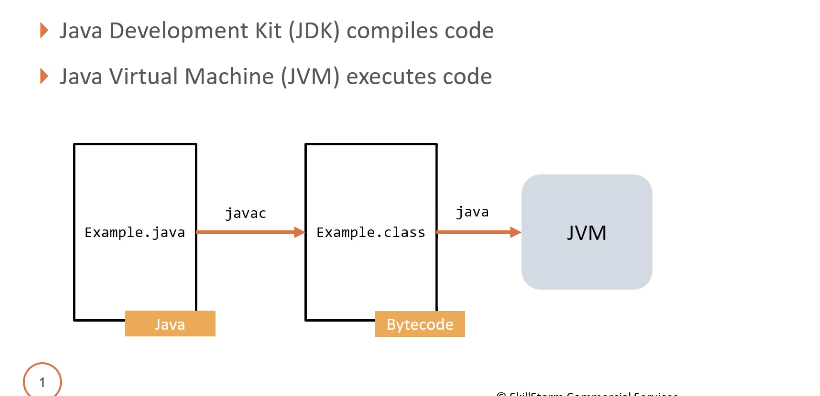

<< [README](./README.md)

# Contents
- [Topics](#topics)
- [Classes & Interfaces](#classes--interfaces)
- [Resources](#resources)

## Topics

- [Arrays](./Arrays.md)

## Classes & Interfaces

## Resources
[Coding With John ↗️](https://www.youtube.com/@CodingWithJohn/videos) - 🎥 YouTube channel with helpful Java tutorials and examples on a variety of topics.

