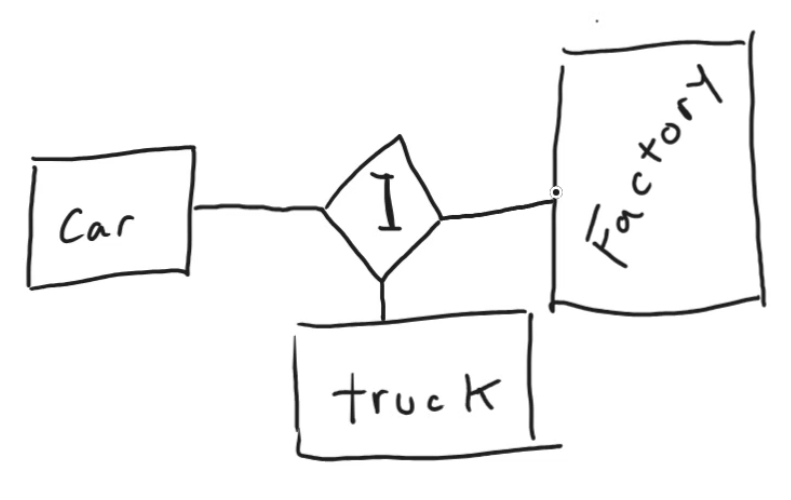
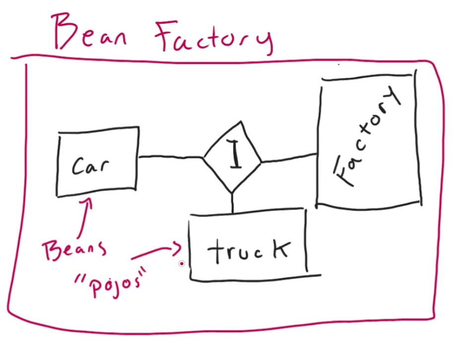

<< [README](./README.md)

# Spring and SpringBoot

### Exam Prep Material
[https://education.oracle.com/product/pexam_1Z0-811](https://education.oracle.com/product/pexam_1Z0-811 "https://education.oracle.com/product/pexam_1Z0-811")

[https://webets-server-aws.enthuware.com/webets.html](https://webets-server-aws.enthuware.com/webets.html "https://webets-server-aws.enthuware.com/webets.html") 

---
### Java 17 Installation

https://www.oracle.com/java/technologies/downloads/#java17

Install Java 17 from this link

Edit JAVA_HOME to `C:\Program Files\Java\jdk-17`
Add `C:\Program Files\Java\jdk-17\bin` to your PATH, removing the older Java entry.

Verify installation with `java -version`

---

## Spring

- Dependency injection
	- Where Spring will manage dependencies for us!
	- Helps with coupling -- reduces the amount of complexity.
- IOC Container
	- "Inversion of Control"
- A little more tedious, requires more configuration than SpringBoot.



We can have car and truck classes. The factory is going to communicate with the Interface, and allow us to ask something like:

```
main {
	factory.getCar()
}
```

The point is, Spring is managing this for us.

Even better, we can wrap this all up further:



With our new "Bean Factory", we can ask for "beans", otherwise known as "pojos" -- or "plain ol' Java objects".

Going back to our IOC --

IOC
 - Contains our Bean Factory
	 - Including all of the beans we create
 - Includes Application Context

## SpringBoot
*(not spring)*

Important Buzzwords:
 - "Convention over Configuration"
	 - In Spring, you have to configure everything.
	 - SpringBoot gives you "opinionated configurations".
		 - Pre-configured project templates, made publicly available.
 - Annotations
	 - `@SpringBootApplications`

---

### SpringBoot Project Example

- Make a new folder in VS Code
- Hit `ctrl + shift + p` to open the command palate
	- Type in `spring initializer`, select the one for Maven
		- Allows us to use Maven tools for the build lifecycle
	- Go through the creation steps
		- Artifact ID is `hello-spring-boot`
		- Use `com.skillstorm` for `groupId`
		- Use `jar` for the package type
		- Specify Java version 17
			- 8 is not supported
		- Select dependencies -- but we don't need any, so hit `enter`

Heading to `pom.xml`
 - This holds our dependencies, properties, Java version, etc.
	 - Note that under `<build>`, we see a `spring-boot-maven-plugin`. 
	 - This allows maven to package our Spring Boot project into a "fat" `.jar` file.
		 - "Fat" `.jar` files include everything needed to run a project.
			 - All code, tools, and dependencies.
	 - If you package as a `.war` file, we won't need this plugin.
		 - `.war` is typically used for web/server use cases.

Heading to `src\main\java\resources\application.properties`
 - This can either be a `.properties` or `.yml` file, but is always named `application`
	 - Always placed in this directory, as well.
 - Here is where properties the project uses can be placed.
	 - If you were to change environments, these properties would stay the same.
- For example, we can add:
	- `spring.application.admin.enabled=false`
	- `spring.config.name=application`
	- `server.port=8282`
	- etc.

For the example, we'll rename our file to `application.yml`.
 - Note the structure:
```
spring:
    application:
        name: hello-spring-boot
        admin:
            enabled: false
    config:
        name: application
    output:
        ansi:
            enabled: ALWAYS
server:
    port: 8282
```

Also note:
 - **The default port number is 8080!**
 - These changes are not necessary for our project -- we just want to show it *can* be done.