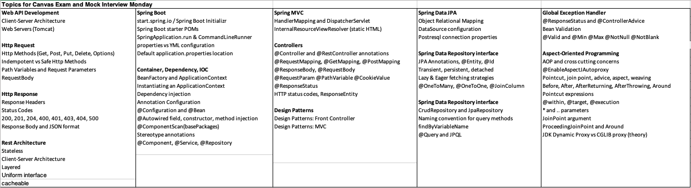

<< [README](./README.md)

# Topics for Canvas Exam and Mock Interview Monday (7/22/2024)

## Contents
- [Web API Development](#web-api-development)
- [HTTP Request](#http-request)
- [HTTP Response](#http-response)
- [Rest Architecture](#rest-architecture)
- [Spring Boot](#spring-boot)
- [Container, Dependency, IOC](#container-dependency-ioc)
- [Spring MVC](#spring-mvc)
- [Controllers](#controllers)
- [Design Patterns](#design-patterns)
- [Spring Data JPA](#spring-data-jpa)
- [Spring Data Repository interface](#spring-data-repository-interface)
- [Spring Data Repository interface](#spring-data-repository-interface-1)
- [Global Exception Handler](#global-exception-handler)
- [Aspect-Oriented Programming](#aspect-oriented-programming)
- [Resources](#resources)

### Web API Development
- Client-Server Architecture
- Web Servers (Tomcat)

## HTTP Request
- Http Methods(Get, Post, Put, Delete, Options)
- [Indempotent](./Idempotence.md) vs Safe Http Methods
- Path Variables and Request Parameters
- RequestBody

## HTTP Response
- Response Headers
- Status Codes
    - 200
    - 201
    - 204
    - 400
    - 401
    - 403
    - 404
    - 500
- Response Body and JSON format

## Rest Architecture
- Stateless
- Client-Server Architecture
- Layered
- Uniform interface
- catcheable

## [Spring Boot](./SpringBoot.md)
- start.spring.io / Spring Boot Initializr
- Spring Boot starter POMs
- SpringApplication.run & CommandLineRunner
- properties vs YML configuration
- Default application.properties location

## Container, Dependency, IOC
- [Bean](./Beans.md)Factory and ApplicationContext
- Instantiating an ApplicationContext
- Dependency injection
- Annotation Configuration
- @Configuration and @Bean
- @Autowired field, constructor, method injection
- @ComponentScan(basePackages)
- Stereotype annotations
- @Component, @Service, @Repository

## Spring MVC
- HandlerMapping and DispatcherServlet
- InternalResourceViewResolver (static HTML)

## Controllers
- @Controller and @RestController annotations
- @RequestMapping, @GetMapping, @PostMapping
- @ResponseBody, @RequestBody
- @RequestParam @PathVariable @CookieValue
- @ResponseStatus
- HTTP status codes, ResponseEntity

## Design Patterns
- Design Patterns: Front Controller
- Design Patterns: MVC

## Spring Data JPA
- Object Relational Mapping
- DataSource configuration
- Postresql connection properties

## Spring Data Repository interface
- JPA Annotations, @Entity, @Id
- Transient, persistent, detached
- Lazy & Eager fetching strategies
- @OneToMany, @OneToOne, @JoinColumn

## Spring Data Repository interface
- CrudRepository and JpaRepository
- Naming convention for query methods
- findByVariableName
- @Query and JPQL

## Global Exception Handler
- @ResponseStatus and @ControllerAdvice
- Bean Validation
- @Valid and @Min @Max @NotNull @NotBlank

## Aspect-Oriented Programming
- AOP and cross cutting concerns
- @EnableAspectJAutoproxy
- Pointcut, join point, advice, aspect, weaving
- Before, After, AfterReturning, AfterThrowing, Around
- Pointcut expressions
- @within, @target, @execution
- \* and .. parameters
- JoinPoint argument
- ProceedingJoinPoint and Around
- JDK Dynamic Proxy vs CGLIB proxy (theory)

## Resources

- [What is an API?↗️](https://www.geeksforgeeks.org/what-is-an-api/) - 📄 Geeks for Geeks
- [What is an API?↗️](https://www.postman.com/what-is-an-api/) - 📄 Postman 
- [What is HTTP?↗️](https://www.geeksforgeeks.org/what-is-http/) - 📄 Geeks for Geeks
- [Difference between URL and URI?↗️](https://stackoverflow.com/questions/4239941/difference-between-url-and-uri) - 📄 Stackoverflow
- [What is REST?↗️](https://restfulapi.net/) - 📄 REST API Tutorial
- [What is the different between HTTP and REST?↗️](https://stackoverflow.com/questions/2190836/) - 📄 Stackoverflow 
- [Introduction to Spring Framework↗️](what-is-the-difference-between-http-and-rest) - 📄Spring Docs
- [What is Spring Framework?](https://docs.spring.io/spring-framework/docs/3.2.x/spring-framework-reference/html/overview.html) - 📄 Spring Docs
- [Controllers in Spring Boot](https://www.baeldung.com/spring-controllers) - 📄 Quick Guide to Spring Controllers
- [Services in Spring Boot↗️](https://www.geeksforgeeks.org/spring-service-annotation-with-example/) - 📄Geeks for Geeks
[Models in Spring Boot](https://spring.io/guides/gs/accessing-data-jpa) - 📄 Accessing Data with JPA
- [A Comprehensive Guide to Annotations in Spring Boot JPA↗️](https://medium.com/@yadavsunil9699/a-comprehensive-guide-to-annotations-in-spring-boot-jpa-950a05b5eb1b#:~:text=A%20Comprehensive%20Guide%20to%20Annotations%20in%20Spring%20Boot,%40Embedded%20...%208%208.%20%40Embeddable%20...%20More%20items) - 📄 Medium article on each annotation
- [Repositories in Spring Boot↗️](https://spring.io/guides/gs/accessing-data-jpa) - 📄 Accessing Data with JPA
- [Queries in Spring Boot↗️](https://docs.spring.io/spring-data/jpa/reference/jpa/query-methods.html) - 📄 JPA Query Methods
- [Data Transfer Objects (DTOs)](https://www.baeldung.com/entity-to-and-from-dto-for-a-java-spring-)
- [Spring Boot AOP and Aspects](https://www.baeldung.com/spring-aop)
- [Spring Boot AOP and Aspects](https://docs.spring.io/spring-framework/reference/core/aop/using-aspectj.html)
- [Spring Boot AOP and Aspects](https://docs.spring.io/spring-framework/reference/core/aop.html)
- [Application Properties](https://www.geeksforgeeks.org/spring-boot-application-properties/)
- [Running Spring Boot Applications](https://docs.spring.io/spring-boot/maven-plugin/run.html)
- [Running Spring Boot Applications](https://stackoverflow.com/questions57206960spring-boot-application-run-configurations-with-vscode)
- [Running Spring Boot Applications](https://code.visualstudio.com/docs/java/java-spring-boot)
- [Configuring launch.json](https://code.visualstudio.com/docs/cpp/launch-json-reference)